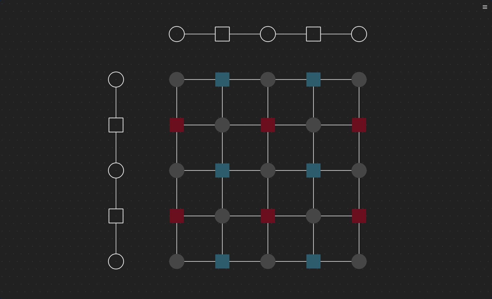

# Weave

A quantum error correction framework that can implement and visualize qubit cross-talk.

## Structure

Weave is structured as a clean hybrid C++/Python codebase with Python at the top level and C++ integrated within:

- `weave/`: All code (both Python and C++)
  - `weave/__init__.py`: Package exports and imports from C++ module
  - `weave/__main__.py`: Entry point for CLI
  - `weave/gui/`: GUI implementation using PySide6
  - `weave/simulator.py`: Python implementation of simulation tools
  
  - `weave/_core/`: C++ implementation (internal)
    - `weave/_core/include/`: Header files
      - `weave/_core/include/weave/`: Core library headers
      - `weave/_core/include/bindings/`: Python binding headers (`.pybind.hpp` files)
    - `weave/_core/src/`: Implementation files
      - `weave/_core/src/codes/`: Implementation of quantum error correction codes
      - `weave/_core/src/util/`: Utility functions and classes
      - `weave/_core/src/bindings/`: Python binding implementation

## Installation

```bash
# Development installation
pip install -e .
```

## GUI

To launch the GUI:

```bash
python -m weave
```

## Development

### Prerequisites

- Python 3.10+
- C++ compiler supporting C++20
- CMake 3.15+
- pybind11

### Building from source

```bash
# Clone the repository
git clone --recursive https://github.com/yourusername/weave.git
cd weave

# Install development dependencies
pip install -e ".[dev]"

# Build the project
pip install -e .
```

### Running tests

```bash
pytest
```

### Developer's Guide

#### Binding Architecture

Weave uses a modular, granular binding architecture for C++ components:

1. **Header Organization**
   - Headers in `weave/_core/include/weave/`: Core C++ library headers
   - Headers in `weave/_core/include/bindings/`: Python binding headers (`.pybind.hpp` files)

2. **Binding Header Responsibilities**
   - Each `.pybind.hpp` file in `include/bindings/` corresponds to a directory in `include/weave/`
   - Example: `util.pybind.hpp` defines bindings for code in `weave/util/`
   - Each header declares multiple granular binding functions, one per component
   - Headers only declare binding functions, no pybind11 macro usage

3. **Binding Granularity**
   - Each component has its own dedicated binding function
   - Example: `bind_pcm` specifically binds the PCM utility functions
   - A higher-level function (e.g., `bind_util`) aggregates related binding functions
   - This allows for easier maintenance and better component organization

4. **Binding Source Files**
   - Implementation in `weave/_core/src/bindings/`
   - Each `.cpp` file implements all binding functions declared in the corresponding header
   - Only source files contain pybind11 macros and actual binding code
   - Binding functions create appropriate submodule hierarchy

5. **Integration**
   - `weave.pybind.cpp` includes all binding headers and calls their high-level binding functions
   - All binding code is registered to the main `_core` module
   - The resulting Python API mirrors the C++ code organization

#### Adding new C++ components

1. **Create header file**
   
   Add a new header in `weave/_core/include/weave/` or an appropriate subdirectory:
   
   ```cpp
   // weave/_core/include/weave/your_component.hpp
   #pragma once
   
   namespace weave {
   
   class YourComponent {
   public:
       // Public methods
       void doSomething();
       
   private:
       // Private members
   };
   
   } // namespace weave
   ```

2. **Implement the component**
   
   Add implementation in `weave/_core/src/` using the same structure:
   
   ```cpp
   // weave/_core/src/your_component.cpp
   #include "weave/your_component.hpp"
   
   namespace weave {
   
   void YourComponent::doSomething() {
       // Implementation
   }
   
   } // namespace weave
   ```

3. **Create Python binding header**
   
   Add binding header (declarations only):
   
   ```cpp
   // weave/_core/include/bindings/your_module.pybind.hpp
   #pragma once
   
   #include <pybind11/pybind11.h>
   
   namespace py = pybind11;
   
   namespace weave {
   namespace bindings {
   
   /**
    * Create Python bindings for all components in the module.
    *
    * @param module The pybind11 module to add the bindings to.
    */
   void bind_your_module(py::module& module);
   
   /**
    * Create Python bindings for the YourComponent class.
    *
    * @param module The pybind11 module to add the bindings to.
    */
   void bind_your_component(py::module& module);
   
   /**
    * Create Python bindings for the AnotherComponent class.
    *
    * @param module The pybind11 module to add the bindings to.
    */
   void bind_another_component(py::module& module);
   
   } // namespace bindings
   } // namespace weave
   ```

4. **Implement binding source**
   
   Add binding implementation (with actual pybind11 code):
   
   ```cpp
   // weave/_core/src/bindings/your_module.pybind.cpp
   #include "bindings/your_module.pybind.hpp"
   
   #include <pybind11/pybind11.h>
   #include <pybind11/stl.h>
   
   #include "weave/your_component.hpp"
   #include "weave/another_component.hpp"
   
   namespace py = pybind11;
   
   namespace weave {
   namespace bindings {
   
   void bind_your_component(py::module& your_module) {
       py::class_<YourComponent>(your_module, "YourComponent")
           .def(py::init<>())
           .def("do_something", &YourComponent::doSomething);
   }
   
   void bind_another_component(py::module& your_module) {
       py::class_<AnotherComponent>(your_module, "AnotherComponent")
           .def(py::init<>())
           .def("do_other_thing", &AnotherComponent::doOtherThing);
   }
   
   void bind_your_module(py::module& module) {
       // Create a submodule
       auto your_module = module.def_submodule("your_module", "Your module description");
       
       // Bind individual components
       bind_your_component(your_module);
       bind_another_component(your_module);
   }
   
   } // namespace bindings
   } // namespace weave
   ```

5. **Register the binding**
   
   Update the main binding file:
   
   ```cpp
   // weave/_core/src/bindings/weave.pybind.cpp
   // Add include
   #include "bindings/your_module.pybind.hpp"
   
   PYBIND11_MODULE(_core, m) {
       // ...
       // Add your new module binding
       weave::bindings::bind_your_module(m);
   }
   ```

6. **Update CMakeLists.txt**
   
   Add your new source files:
   
   ```cmake
   set(WEAVE_CORE_SOURCES
       # ...
       weave/_core/src/your_component.cpp
       weave/_core/src/bindings/your_component.pybind.cpp
   )
   ```

7. **Expose in Python**
   
   Update `weave/__init__.py`:
   
   ```python
   from ._core import (
       # ...
       YourComponent,
   )
   
   __all__ = [
       # ...
       "YourComponent",
   ]
   ```

#### Adding Python components

1. **Create Python module**
   
   Add a new Python file in `weave/` or a subdirectory:
   
   ```python
   # weave/your_module.py
   
   class YourPythonComponent:
       def __init__(self):
           # Initialize
           pass
           
       def do_something(self):
           # Implementation
           pass
   ```

2. **Expose in the package**
   
   Update `weave/__init__.py`:
   
   ```python
   from .your_module import YourPythonComponent
   
   __all__ = [
       # ...
       "YourPythonComponent",
   ]
   ```
