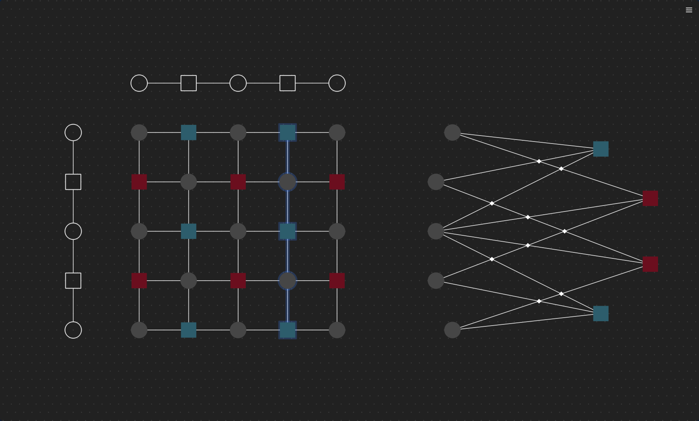
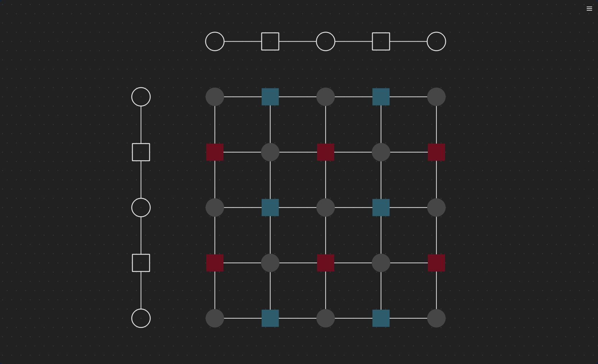

# Weave

**A framework for constructing, visualizing, and simulating quantum error-correcting codes with cross-talk modeling.**


Weave builds CSS codes and hypergraph product codes, embeds their Tanner graphs in 2D, detects edge crossings as a model for qubit cross-talk, and generates [Stim](https://github.com/quantumlib/Stim) circuits for noise simulation. It includes a PySide6 GUI editor for interactive code construction and a [Sinter](https://github.com/quantumlib/Stim/tree/main/glue/sinter) backend for batch decoding.

---

## Installation

**Prerequisites:** Python >= 3.10, < 3.14 and [uv](https://docs.astral.sh/uv/).

```bash
git clone https://github.com/angelodibella/weave.git
cd weave
uv sync                  # install all dependencies
uv run pytest            # verify — should pass 60 tests
```

---

## Quick Start

### Create a code and inspect its circuit

```python
from weave import CSSCode, NoiseModel
from weave.util import pcm

# Steane [[7,1,3]] code from the Hamming(7) parity-check matrix
H = pcm.hamming(7)
code = CSSCode(HX=H, HZ=H)

print(f"[[{code.n}, {code.k}]]")   # [[7, 1]]
print(code.circuit)                 # Stim circuit (noiseless by default)
```

### Add noise and sample

```python
import stim

noisy_code = CSSCode(
    HX=H, HZ=H,
    noise=NoiseModel(data=0.001, circuit=0.001),
    rounds=5,
)
sampler = noisy_code.circuit.compile_detector_sampler()
detections, observables = sampler.sample(shots=1000, separate_observables=True)
```

### Hypergraph product code

```python
from weave import HypergraphProductCode

H1 = pcm.repetition(3)
H2 = pcm.repetition(3)
hp_code = HypergraphProductCode(H1, H2)
print(f"[[{hp_code.n}, {hp_code.k}]]")  # [[18, 1]]
```

### Batch simulation with Sinter

```python
import sinter

noisy_hp = HypergraphProductCode(
    H1, H2,
    noise=NoiseModel(data=0.001, circuit=0.001),
    rounds=5,
)
tasks = [sinter.Task(circuit=noisy_hp.circuit)]
results = sinter.collect(
    num_workers=4,
    tasks=tasks,
    decoders=["bposd"],
    max_shots=10_000,
)
for result in results:
    print(f"Logical error rate: {result.errors / result.shots:.4f}")
```

---

## GUI Editor

Launch with:

```bash
uv run wv
```



The editor provides a visual Tanner graph canvas for constructing quantum codes interactively.

### Features

- **Node types** — Qubits (gray circles), Z-stabilizers (blue squares), X-stabilizers (pink squares)
- **Edge drawing** — Ctrl+click a node to draw an edge from the current selection
- **Crossing detection** — Toggle "Show Crossings" to see where Tanner graph edges cross
- **Dark mode** — Toggle via the hamburger menu
- **Simulate...** — Extract the canvas as a `CSSCode`, configure noise/rounds/shots, and run a Sinter simulation
- **Export Code...** — Export HX/HZ parity-check matrices as CSV

### Keyboard Shortcuts

| Shortcut | Action |
|---|---|
| `Ctrl+S` | Save canvas (JSON) |
| `Ctrl+O` | Load canvas (JSON) |
| `Ctrl+C` / `Ctrl+V` | Copy / paste selected nodes |
| `Ctrl+A` | Select all |
| `Ctrl+=` / `Ctrl+-` | Zoom in / out |
| `Ctrl+0` | Reset zoom |
| `G` | Toggle grid snap |
| `Delete` | Delete selection |
| `Escape` | Deselect all |

---

## Core Concepts

### CSS Codes

A Calderbank-Shor-Steane (CSS) code is defined by two binary parity-check matrices **HX** and **HZ** satisfying the CSS condition **HX · HZ^T = 0 (mod 2)**. HX defines X-stabilizers and HZ defines Z-stabilizers. Weave's `CSSCode` class takes these matrices and generates a complete Stim circuit with stabilizer measurement rounds, detectors, and logical observables.

### Hypergraph Product Codes

Given two classical codes with parity-check matrices H1 and H2, the hypergraph product constructs:

```
HX = [ H1 ⊗ I  |  I ⊗ H2^T ]
HZ = [ I ⊗ H2  |  H1^T ⊗ I ]
```

This produces a CSS code whose parameters depend on both input codes. `HypergraphProductCode` computes this product and delegates to `CSSCode`.

### Tanner Graphs and Crossings

A Tanner graph is a bipartite graph connecting data qubits to their stabilizer checks. When this graph is embedded in 2D, edges may cross. Weave treats each crossing as a potential source of **correlated two-qubit noise** (cross-talk), injecting `PAULI_CHANNEL_2` errors on the crossing qubit pairs during circuit generation.

Call `code.embed()` to compute a layout and detect crossings, then `code.draw()` to visualize:

```python
code = CSSCode(HX=H, HZ=H, noise=NoiseModel(crossing=0.01))
code.embed(pos="spring")
code.draw()
```

### Noise Model

`NoiseModel` supports five independent noise channels:

| Channel | Stim instruction | Parameters |
|---|---|---|
| `data` | `PAULI_CHANNEL_1` on data qubits | 3 (X, Y, Z) |
| `z_check` | `PAULI_CHANNEL_1` on Z-ancillas | 3 |
| `x_check` | `PAULI_CHANNEL_1` on X-ancillas | 3 |
| `circuit` | `PAULI_CHANNEL_2` after each CNOT | 15 |
| `crossing` | `PAULI_CHANNEL_2` on crossing pairs | 15 |

Pass a scalar to distribute uniformly across parameters, or a list for fine-grained control.

### Circuit Structure

Generated Stim circuits follow this structure:

1. **Head** — Initialize qubits (`R` for z_memory, `RX` for x_memory)
2. **Rounds** (repeated) — Z-check CNOTs, X-check H-CNOT-H brackets, noise channels, ancilla measurement (`MR`)
3. **Tail** — Data qubit measurement, detector definitions, `OBSERVABLE_INCLUDE` for logical operators

---

## API Reference

### `CSSCode(HX, HZ, rounds=3, noise=None, experiment="z_memory", logical=None)`

Core class for CSS code simulation. Key members:

- `.circuit` — Lazy `stim.Circuit` property (generated on first access)
- `.embed(pos=None)` — Compute Tanner graph layout and detect crossings. Accepts `"random"`, `"spring"`, `"bipartite"`, `"tripartite"`, or explicit coordinates
- `.draw()` — Matplotlib visualization (requires prior `embed()`)
- `.find_logicals()` — Returns `(x_logicals, z_logicals)` with symplectic pairing
- `.n`, `.k` — Code parameters

### `HypergraphProductCode(H1, H2, rounds=3, noise=None, experiment="z_memory", logical=None)`

Subclass of `CSSCode`. Computes the hypergraph product of two classical parity-check matrices.

### `NoiseModel(data=0.0, z_check=0.0, x_check=0.0, circuit=0.0, crossing=0.0)`

Container for noise parameters. Each channel accepts a scalar or a list of floats.

### `weave.util.pcm`

| Function | Description |
|---|---|
| `repetition(n)` | Repetition code parity-check matrix |
| `hamming(n)` | Hamming code parity-check matrix (n must be 2^m - 1) |
| `hypergraph_product(H1, H2)` | Returns `(HX, HZ)` tuple |
| `distance(H)` | Brute-force minimum distance |
| `row_echelon(M)` | GF(2) row echelon form |
| `nullspace(M)` | GF(2) nullspace |
| `row_basis(M)` | Independent row basis |
| `to_clist(H)` / `to_matrix(clist)` | Serialization helpers |

### `weave.util.graph`

| Function | Description |
|---|---|
| `compute_layout(graph, pos_spec)` | Compute node positions for a NetworkX graph |
| `find_edge_crossings(pos, edges)` | Detect crossing edge pairs |
| `draw(graph, pos, ...)` | Matplotlib Tanner graph renderer |

### `weave.surface.Torus(Lx, Ly, node_coords=None, major_radius=None, minor_radius=None)`

Flat torus with periodic boundary conditions. Implements the `Surface` ABC with geodesic shortest paths, periodic intersection checks, Liang-Barsky clipping for 2D drawing, and 3D torus embedding.

---

## Project Structure

```
weave/
├── codes/
│   ├── base.py                  # NoiseModel, ClassicalCode, QuantumCode ABC
│   ├── css_code.py              # CSSCode — circuit generation and embedding
│   └── hypergraph_product_code.py  # HypergraphProductCode
├── gui/
│   ├── canvas.py                # Interactive Tanner graph canvas
│   ├── editor.py                # Application entry point
│   ├── simulation.py            # SimulationDialog and background worker
│   ├── theme.py                 # Light/dark theme manager
│   └── windows.py               # MainWindow
├── surface/
│   ├── base.py                  # Surface ABC
│   └── torus.py                 # Torus implementation
├── tests/                       # 60 tests across 5 files
└── util/
    ├── graph.py                 # Tanner graph layout, crossings, drawing
    └── pcm.py                   # GF(2) linear algebra and code constructions
```

---

## Examples

- **`examples/Tutorial.ipynb`** — Jupyter notebook walking through code construction, embedding, and simulation
- **`examples/canvases/`** — Saved GUI canvases (`simple_demo.json`, `surface_code.json`) that can be loaded with Ctrl+O

---

## Testing

```bash
uv run pytest                  # run all 60 tests
uv run pytest -v               # verbose output
uv run pytest weave/tests/test_pcm.py  # single file
```

Test coverage includes: Steane code circuit correctness, noiseless detector validation, noisy detector error models, logical operator validity with symplectic pairing, lazy circuit generation/invalidation, CSS condition enforcement, noise model edge cases, hypergraph product parameter verification, GF(2) linear algebra, canvas-to-code bridge roundtrips, and code distance computation.

---

## Roadmap

Development is organized in three phases:

- **Phase I — Physical Correctness**: Complete except TICK markers, CNOT scheduling, and idle noise
- **Phase II — Bugs & Modernization**: Complete except sparse matrix support and performance optimizations
- **Phase III — Novelty & Extensibility**: Crossing error models, topological surface embeddings, chain complexes, GUI-simulation bridge

See [ROADMAP.md](ROADMAP.md) for full details.

---

## Contributing

Contributions are welcome. To get started:

1. Fork the repository and create a feature branch
2. Install dependencies: `uv sync`
3. Make your changes and add tests
4. Run the test suite: `uv run pytest`
5. Submit a pull request

Please follow the existing code style: built-in type generics (`list`, `tuple`, `X | None`), `ValueError` for input validation, and type annotations on public APIs.

---

## License

MIT License. See [LICENSE](LICENSE) for details.
